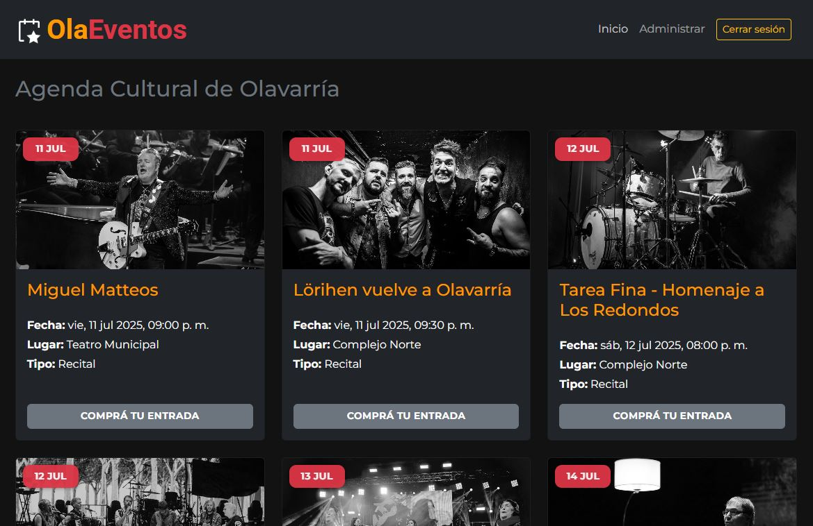

# 🎭 OlaEventos - Plataforma de Gestión de Eventos y Espacios Culturales



**OlaEventos** es una plataforma web full stack diseñada para facilitar la gestión, publicación y visualización de eventos culturales en la ciudad de Olavarría. Fue desarrollada como solución digital moderna para instituciones, gestores culturales o municipios que deseen promover la cultura local de forma accesible.

---

## 🚀 Funcionalidades principales

### 👤 Público general
- Navegación abierta de eventos próximos con detalles.
- Filtros por tipo de evento o lugar.
- Diseño adaptable para dispositivos móviles.

### 🛠️ Administrador
- Panel privado con autenticación.
- Crear, editar y eliminar eventos culturales.
- Administrar espacios/lugares culturales.
- Confirmaciones visuales y alertas interactivas.
- Paginación para listas extensas.
- Diseño responsive y amigable.

---

## ⚙️ Tecnologías utilizadas

### 🧠 Backend
- **Nestjs** + **Express**
- **Base de datos**: PostgreSQL
- **ORM**: Sequelize
- **Autenticación**: JWT
- **Validación**: Middleware personalizado

### 🎨 Frontend
- **React** (Vite)
- **Bootstrap 5** + estilos personalizados
- **Componentes reutilizables** (formularios, modales, diálogos)
- **Fetch API** para comunicación con el backend

---

## 🗂️ Estructura del proyecto

📁 backend/
├── controllers/
├── models/
├── routes/
└── index.js

📁 frontend/
├── components/
│ ├── EventosAdminSection.jsx
│ ├── LugaresAdminSection.jsx
│ └── ...
├── views/
├── App.jsx
└── main.jsx

---

## 🔐 Acceso al panel de administración

Para acceder al panel de administración, debés contar con un token JWT válido generado por el backend al iniciar sesión.

> ⚠️ En esta versión, la autenticación se gestiona mediante `localStorage`.

---

## 💡 Posibles usos del sistema

- Secretarías de Cultura municipales.
- Espacios culturales independientes.
- Centros de estudiantes o colectivos culturales.
- Organización y difusión de festivales o ciclos de actividades.

---

## 📦 Instalación y ejecución local

1. Cloná el repositorio:

```bash
git clone https://github.com/FacuDee/OlaEventos.git
